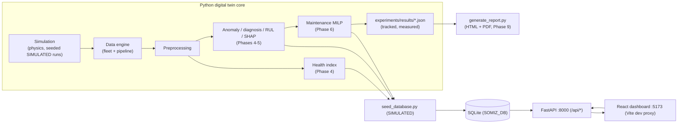

# SOMIZ Digital Twin Platform

A full digital-twin platform for industrial rotating equipment (modeled on the
SOMIZ site, Arzew, Oran, Algeria): physics-based simulation, data engine, health
monitoring, fault diagnosis, remaining-useful-life (RUL) estimation,
maintenance optimization, a FastAPI backend, a React dashboard, and automatic
HTML/PDF reporting.

> ⚠️ **HONEST SCOPE - all data is SIMULATED.**
>
> Every sensor value, fault, diagnosis, RUL estimate and maintenance plan in
> this repository comes from the physics simulator in `simulation/`, from ML
> models trained on those simulations, or from optimizations on those same
> inputs. **There is no live sensor connection (no PLC/SCADA/TIWEST feed) and
> no SOMIZ deployment claim anywhere in the repo.** The telemetry bridge is a
> documented placeholder (see `.env.example` and
> [Connecting real data](#connecting-real-data)). Do not use these numbers for
> real maintenance decisions.

## Platform overview

| Layer | Component | Tech |
|---|---|---|
| Core | Physics simulator + data engine + preprocessing | NumPy / SciPy / pandas / pyarrow |
| Intelligence | Health index, anomaly detection, diagnosis, RUL, SHAP | scikit-learn / PyTorch (CPU) / shap |
| Optimisation | Maintenance scheduling (MILP) | SciPy HiGHS (CVXPY upgrade path) |
| Backend | REST + OpenAPI, SQLite persistence | FastAPI / SQLAlchemy / Pydantic v2 |
| Dashboard | Thin display layer, 7 views | React / TypeScript / Vite / Plotly / Three.js |
| Reports | HTML + A4 PDF from tracked result artefacts | jinja2 / WeasyPrint |

The dashboard is only the display layer: all intelligence lives in the Python
core, and every number it shows is traceable to a versioned experiment
artefact.

## Architecture



The two arrows into the database say: the seeded DB (4 pump assets, ~32 000
measurements, all SIMULATED) is the single source the API and dashboard read.

## Quickstart

Requires Python 3.12+ and Node.js 22+ (LTS) for the frontend.

```bash
# 1. Python environment and dependencies
python3 -m venv .venv
.venv/bin/pip install -r requirements.txt
# Optional: CPU build of PyTorch for the autoencoder / MLP models
.venv/bin/pip install torch --index-url https://download.pytorch.org/whl/cpu

# 2. Seed the SIMULATED database (data/somiz.db, gitignored)
.venv/bin/python scripts/seed_database.py

# 3. Run the backend (API + OpenAPI docs on /docs)
.venv/bin/python -m uvicorn backend.main:app --port 8000

# 4. Run the dashboard (new terminal)
cd frontend
npm install
npm run dev            # http://localhost:5173 (proxies /api to :8000)
```

Tests (179 at the end of Phase 9):

```bash
.venv/bin/python -m pytest
```

Experiments and reports:

```bash
# Re-run any phase experiment (writes tracked experiments/results/*.json)
.venv/bin/python scripts/run_anomaly_experiment.py
.venv/bin/python scripts/run_diagnosis_experiment.py
.venv/bin/python scripts/run_optimization_experiment.py
.venv/bin/python scripts/run_research_experiments.py

# Generate the HTML + PDF report from the tracked artefacts
.venv/bin/python scripts/generate_report.py   # reports/generated/somiz_report.{html,pdf}
```

## Measured results (SIMULATED)

Honest headline numbers, all from executed experiments (Phases 4-9); see
`experiments/results/*.json` and the per-phase docs:

| Capability | Measured value |
|---|---|
| Anomaly detection, statistical baseline | AUC 0.997, F1 0.979, delay 31 s at 2 % FAR |
| Anomaly detection, windowed autoencoder | AUC 0.998, real (non-zero) delays on slow faults |
| Diagnosis, ML classifiers | macro-F1 0.9978-0.9995 |
| Diagnosis, no-ML heuristic | macro-F1 0.314 (kept as the honest naive bar) |
| RUL, GBM | pooled MAE 273 s over 108 005 simulated samples |
| RUL interval coverage (p10-p90) | 0.9053 |
| Maintenance MILP vs do-nothing | -85 % on the simulated plan |
| Maintenance MILP vs greedy (tight capacity) | -4 % to -14 % |
| Early detection (onset 100-500 s) | delay onset-independent per mode, 17-70 s |

## Plant model and the machine count

Two distinct representations exist; one of them used to be miscounted in this
README (now fixed):

- **Digital-twin fleet (new platform)**: abstract rotating-equipment assets
  (motor-driven centrifugal pumps, 9 sensor channels) generated by the
  simulator. The seeded production DB contains **4 pump assets**; experiment
  fleets vary between 6 and 17 assets.
- **Legacy plant viewer (`index.html`)**: the original single-file 3D layout of
  the SOMIZ Arzew site, **4 ateliers (DIS, DLOG, Centrale, DCA) and 54
  machines** (the README previously claimed 69; the layout defines 54 `mkEquip`
  entries). It is kept as the plant-visualization seed and still runs:

  ```bash
  python3 -m http.server 8000 --directory .   # open http://localhost:8000
  ```

## Technical documentation

| Document | Covers |
|---|---|
| [ARCHITECTURE.md](docs/ARCHITECTURE.md) | Runtime + data-flow diagrams, single source of truth |
| [MATHEMATICAL_MODEL.md](docs/MATHEMATICAL_MODEL.md) | Physics model of the rotating-machine digital twin |
| [DATA_GENERATION.md](docs/DATA_GENERATION.md) | Fleet generation, scenarios, preprocessing pipeline |
| [HEALTH_INDEX.md](docs/HEALTH_INDEX.md) | Time-indexed commissioning reference curve |
| [ANOMALY_DETECTION.md](docs/ANOMALY_DETECTION.md) | Statistical + ML anomaly detectors, metrics |
| [DIAGNOSIS_RUL.md](docs/DIAGNOSIS_RUL.md) | Fault diagnosis, RUL, uncertainty, SHAP |
| [OPTIMIZATION_MAINTENANCE.md](docs/OPTIMIZATION_MAINTENANCE.md) | Criticality model + MILP scheduling |
| [API.md](docs/API.md) | FastAPI endpoints, models, examples |
| [DASHBOARD.md](docs/DASHBOARD.md) | Dashboard views and how to run it |
| [RESEARCH_AND_REPORTS.md](docs/RESEARCH_AND_REPORTS.md) | Phase 9 research experiments + report pipeline |
| [DEPLOYMENT.md](docs/DEPLOYMENT.md) | Phase 12: Vercel Services config + Docker self-host plan |

The roadmap and every architectural decision are tracked in
[PROJECT_AUDIT.md](PROJECT_AUDIT.md).

## Honest labels policy

Three labels are used consistently across code, docs, artefacts and reports:

- **SIMULATED** - produced by the physics simulator or deterministic seed.
- **MODEL ASSUMPTION** - a stated assumption inside a model (e.g. criticality
  terciles, cost ratios).
- **EXPERIMENTAL RESULT** - a measured value from an executed experiment
  (never fabricated, never extrapolated beyond the experiment).

## Repository layout

| Path | Contents |
|---|---|
| `simulation/` | Physics simulator, faults, operating profiles |
| `dataengine/` | Fleet generation + manifest (deterministic seeds) |
| `pipeline/` | Preprocessing |
| `digital_twin/` | Health index |
| `ml/` | Anomaly, diagnosis, RUL, explainability |
| `optimization/` | Criticality + MILP/greedy schedulers |
| `backend/` | FastAPI app (routers, models, schemas) |
| `frontend/` | Vite + React + TS + Plotly + Three.js dashboard |
| `scripts/` | Seed, experiments, report generation |
| `experiments/results/` | **Tracked** measured-result artefacts (JSON) |
| `reports/templates/` + `reports/generated/` | Report template (tracked) + output (gitignored) |
| `docs/` | This documentation set |
| `data/` | `somiz.db` (seeded, gitignored), generated datasets |

`data/generated/`, `*.parquet`, `*.db`, `.env`, `models/artifacts/`,
`reports/generated/`, `frontend/node_modules/` and `frontend/dist/` are
gitignored. `experiments/results/` is tracked on purpose.

## Connecting real data (future)

The data path is centralized so telemetry can be swapped in without touching
the UI:

1. `.env.example` documents the (not implemented) telemetry bridge:
   `SOMIZ_TELEMETRY_ENDPOINT`, `SOMIZ_TELEMETRY_MODE=off | simulated | real`.
2. `dataengine/generator.py` is the only writer of sensor frames; the
   simulator output is the reference for a future poller (OPC UA / Modbus /
   MQTT).
3. The backend reads `SOMIZ_DB` (SQLite path); point it at a DB populated by
   real measurements and the API contract in `docs/API.md` stays unchanged.

## A note on names

SOMIZ is the real industrial site name; plant layout, equipment names and
maintenance records in this platform are **illustrative placeholders built on
SIMULATED data**, not exported plant data.