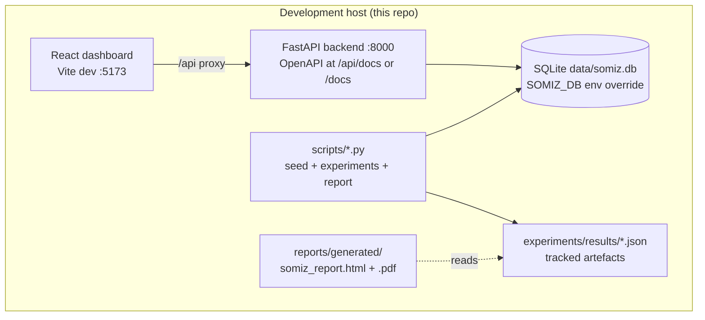
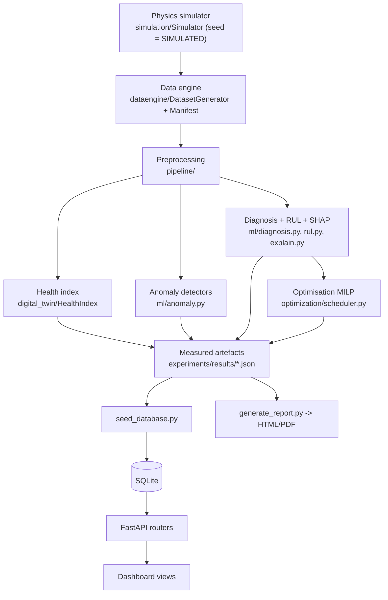

# SOMIZ Platform Architecture

This document describes the runtime and data-flow architecture of the SOMIZ
digital twin platform (Phases 2-9). Every layer is honest about its source:
the whole platform consumes SIMULATED physics runs unless a real telemetry
bridge is later plugged in (placeholder only, see `.env.example`).

## 1. Runtime topology

Dev proxying: the Vite dev server forwards `/api` and `/health` to
`http://127.0.0.1:8000` (`frontend/vite.config.ts`). In production the same
origin serves both via the reverse proxy (see Phase 12, not yet implemented).

## 2. Data flow: SIMULATED telemetry to decision

Reads flow right-to-left in this diagram: every block downstream consumes only
what upstream produced. Nothing is written outside `experiments/results/`
(tracked) except the seeded database and the regenerable report output.

## 3. Single source of truth

| Artefact | Written by | Read by | Tracked? |
|---|---|---|---|
| Simulated frames | `simulation/` + `dataengine/` | pipeline, ML, health index | data gitignored |
| `experiments/results/*.json` | experiment scripts | reports, README, docs | **yes** |
| `data/somiz.db` | `scripts/seed_database.py` | FastAPI | no (regenerable) |
| `reports/generated/*` | `scripts/generate_report.py` | humans (PDF/HTML) | no (regenerable) |

The `generate_report.py` pipeline performs no computation: it renders the
tracked artefacts only, so the report can never diverge from what was
measured. A regression test asserts the artefacts stay byte-identical after a
report render (`tests/test_report_generation.py`).

## 4. Extension points (honest status)

| Extension | Status | Where |
|---|---|---|
| Real telemetry bridge | NOT IMPLEMENTED (placeholder) | `.env.example` |
| CVXPY formulation of the MILP | documented upgrade path | `optimization/` docstring |
| Robustness of the plan to RUL error | open research item | `docs/RESEARCH_AND_REPORTS.md` |
| Deployment (Docker, Pages) | Phase 12, not started | `PROJECT_AUDIT.md` |